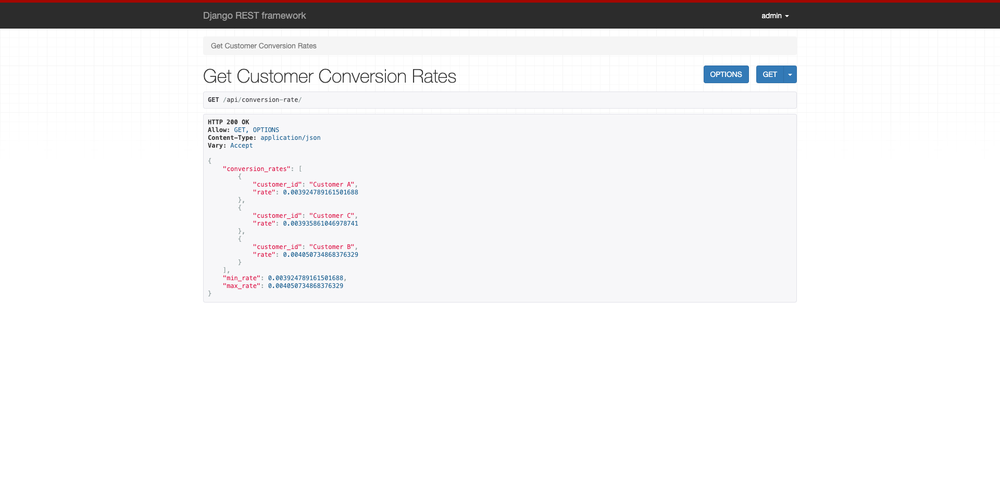
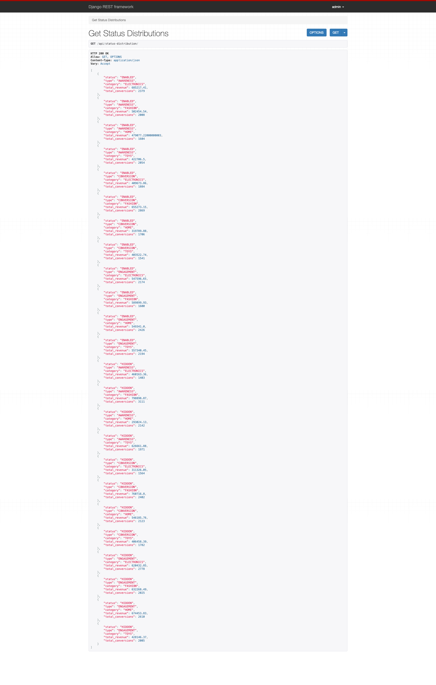
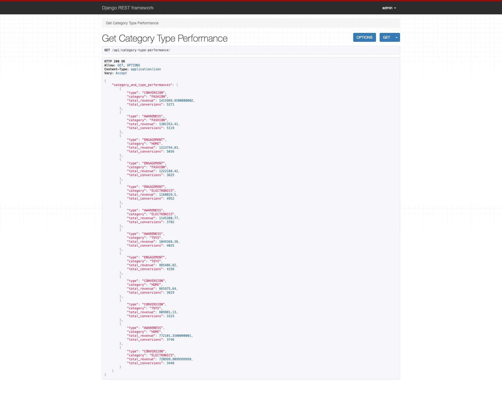
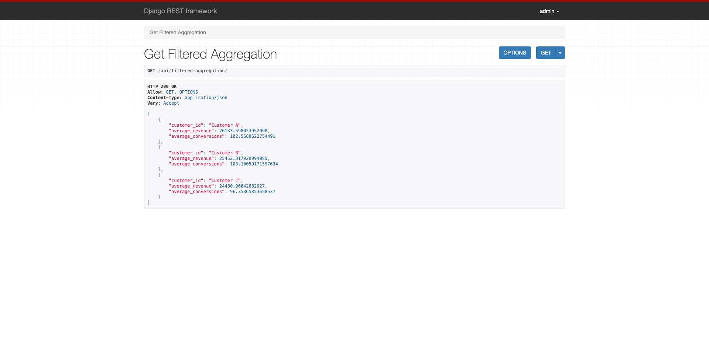

# Orphex - Python Backend Developer Pre-Interview Case Study v5

## Introduction

This case study focuses on developing an exploratory analysis for a customer about their Meta campaigns and results.

## Scenario

You are provided with a dataset that tracks various metrics related to digital marketing conversions, including fields for customer_id, revenue, conversions, status, type, and more. You need to process this data and create a Django-based backend that provides insightful analytics through a web API.

## Dataset

[mockupinterviewdata.csv](./data/mockupinterviewdata.csv)

## Task

### Part 1: Data Analysis (Pandas)

- [X] **Conversion Rate Calculation:**

- Calculate the conversion rate for each `customer_id`, defined as the ratio of conversions to revenue.

- Identify the `customer_id` with the highest and lowest conversion rates.

- [X] **Status-Based Analysis:**

- Analyze the distribution of status (e.g., `ENABLED` vs. `HIDDEN`) across different types and categories.

- Determine the total revenue and conversions for each status type.

- [X] **Category and Type Performance:**

- Calculate the total revenue and total conversions grouped by category and type.

- Identify the category and type combination that generates the most conversions.

- [X] **Filter and Aggregate:**

- Filter the data to include only rows where type is `CONVERSION` and analyze the revenue and conversions.

- Aggregate this filtered data to provide the average revenue and conversions for each `customer_id`.

### Part 2: Web API Development (Django)

Using the results from the analysis, the candidate should be required to develop a Django RESTful API with the following endpoints:

- [X] **Endpoint 1:** /api/conversion-rate/

- Returns the conversion rate for each `customer_id`, along with the highest and lowest conversion rates.

- [X] **Endpoint 2:** /api/status-distribution/

- Provides a summary of the distribution of status across different types and categories. This should include total revenue and conversions for each status.

- [X] **Endpoint 3:** /api/category-type-performance/

- Returns the total revenue and conversions grouped by category and type. It should also highlight the top-performing category and type combination.

- [X] **Endpoint 4:** /api/filtered-aggregation/

- Exposes aggregated data for rows where type is `CONVERSION`, returning the average revenue and conversions per `customer_id`.

## Getting Started

### Prerequisites

- [Python3.12](https://www.python.org/downloads/)

### Installation

```[bash]
python3.12 -m venv ".venv"
source ./.venv/bin/activate
pip install -r requirements.txt
```

### Usage

```[bash]
python manage.py migrate
python manage.py runserver
```

To create a admin/super user:

```[bash]
python manage.py createsuperuser
```

- To health check : http://localhost:8000/health-check/
- To login http://localhost:8000/admin or http://localhost:8000/api-auth/login/
- To process provided dataset: http://localhost:8000/worker/process-data
- To get conversion rates for each customer: http://localhost:8000/api/conversion-rate/
- To get status distributions: http://localhost:8000/api/status-distribution/
- To get category and type performances: http://localhost:8000/api/category-type-performance/
- To get filtered and averaged revenue and conversions for each customer: http://localhost:8000/api/filtered-aggregation

### Future works

- Swagger API for provided endpoint
- Unit tests
- Cache structure for endpoints, where cache will be only evicted by process-data

## Deliverables

- Logs from Data Analysis part: [task1-logs.txt](./deliverables/task1-logs.txt)
- 
- 
- 
- 
